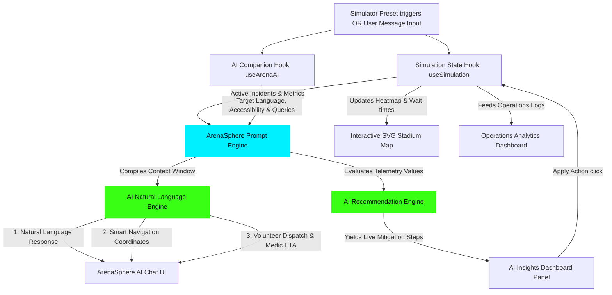

# 🏆 ArenaSphere 2026: FIFA World Cup Smart Stadium & Fan Copilot

ArenaSphere 2026 is a premium, GenAI-enabled platform designed to optimize stadium operations and enrich the tournament experience for fans, organizers, volunteers, and venue staff during the FIFA World Cup 2026.

The web application showcases how Generative AI can be leveraged to handle navigation, crowd management, multilingual communication, real-time stadium operations, accessibility assistance, and sustainability tracking in a simulated, interactive smart stadium dashboard.

---

## 📸 Application Preview & Visual Walkthrough

Here is the visual operations dashboard and copilot console in action:

| **Main Dashboard & Command Center** | **Gate Congestion & AI Recommendations** |
|:---:|:---:|
|  | *Automated live telemetry map showing safety heatmaps, concession wait times, and emergency alerts.* |

*(Note: Add your custom screenshots inside `src/assets/` to display them directly in this section!)*

---

## ⚙️ System Architecture & Data Workflows

ArenaSphere 2026 operates as an event-driven AI Operations Center. Below is the architecture of how state updates, prompt contexts, and AI engines coordinate in a closed loop:



### Key Data Workflows:
1. **Interactive Closed-Loop Mitigation**: Triggering an incident (e.g. Broken scan pedestal) modifies metrics. The **AI Recommendation Engine** generates a mitigation task (e.g., redirecting crowds). Clicking **Apply Action** dispatches a command which resolves the incident and restores metrics to normal.
2. **Context Compilation**: The prompter merges role profiles (Fan, Staff, Volunteer) and telemetry parameters into a single prompt envelope, which can be inspected directly in the UI via the **View AI Prompt Context** console button.

---

## 🌟 Key Features

* **Branded ArenaSphere AI**: Custom-tailored assistant that dynamically adjusts its instructions, routing constraints, and safety profiles according to whether the user is a **Fan**, **Staff**, or **Volunteer**.
* **Smart Rerouting Navigation**: Renders coordinate-by-coordinate routing steps (e.g., Gate C to Metro terminal) with distance tracking, estimated transit times, and smart avoidance of active congestion bottlenecks.
* **Accessibility Companion**: Elevates viewport to high-contrast variables, scales text labels, translates navigation instructions to prioritize ramps and elevators, and speaks AI answers out loud using the HTML5 voice synthesizer.
* **Emergency Dispatch Coordinator**: Flags medical, safety, or lost-guest keywords to launch priority cards showing volunteer ETAs, medic locations, and checklists of notified safety organizations.
* **Halftime Concession Wait Tracker**: Compiles wait timers for food courts and restrooms, comparing live queues with AI-predicted targets on custom graphs.
* **Automated Daily Report Builder**: Generates exhaustive Markdown ops briefings summarizing attendance, sensor metrics, carbon offsets, and active incidents in a single click.
* **Sustainability Microgrid Analytics**: Live tracking of microgrid solar generation versus grid backup and AI eco recommendations.

---

## 🛠 Tech Stack & Tools

* **Framework**: React 19 (TypeScript)
* **Build System**: Vite 6
* **Iconography**: Lucide React
* **Styling**: Vanilla CSS (Tailored variables for dark neon sports-tech themes, responsive viewports, and high-contrast contrast overrides)
* **APIs**: Web Speech Synthesis API (for screen readers)
* **Compiler Checkers**: TypeScript and ESLint configurations

---

## 📂 Project Structure

```bash
src/
├── components/
│   ├── AICopilot.tsx           # ArenaSphere AI Sidebar (chat, prompt inspector, text-to-speech)
│   ├── AIInsightsPanel.tsx     # Live neural suggestions & emergency overrides
│   ├── KPIWidget.tsx           # Metric dashboard indicators
│   ├── Navbar.tsx              # Persona control decks & Accessibility toggle
│   ├── OperationsDashboard.tsx # Eco gauges, wait-time bar charts, report modal
│   ├── SimulatorPanel.tsx      # Scenario decks (12+ matchday presets)
│   └── StadiumMap.tsx          # SVG live sector heatmap & incident overlays
├── data/
│   ├── incidents.ts            # Preset simulator configurations
│   ├── stadiumData.ts          # Section metrics and coordinates
│   └── translations.ts         # Multilingual translation dictionary
├── hooks/
│   ├── useArenaAI.ts           # Chat histories and voice transcription simulator
│   └── useSimulation.ts        # Metrics state modifiers and incident dispatchers
├── styles/
│   └── globals.css             # Main styling, glassmorphism theme, accessibility overrides
├── types/
│   └── stadium.ts              # TypeScript interfaces
├── utils/
│   ├── aiEngine.ts             # LLM response simulator & report generation
│   ├── promptGenerator.ts      # Compiles structured system prompts
│   └── recommendationEngine.ts # Live operational adjustments analyzer
├── App.tsx                     # Core workspace layout
└── main.tsx                    # Entrypoint mounting
```

---

## 🚀 Setup & Installation

Follow these steps to run the ArenaSphere 2026 operations dashboard locally:

### 1. Prerequisites
Make sure you have [Node.js](https://nodejs.org/) installed (v18.0 or later recommended).

### 2. Clone the Repository
```bash
git clone https://github.com/bollepallideviharshini/ArenaSphere-2026-FIFA-World-Cup-Smart-Stadium-Fan-Copilot.git
cd ArenaSphere-2026-FIFA-World-Cup-Smart-Stadium-Fan-Copilot
```

### 3. Install Dependencies
```bash
npm install
```

### 4. Run the Development Server
```bash
npm run dev
```
Open [http://localhost:5173/](http://localhost:5173/) in your web browser.

### 5. Build for Production
To build a production bundle ready for deployment:
```bash
npm run build
```
Compiled assets will be saved to the `dist/` directory.
